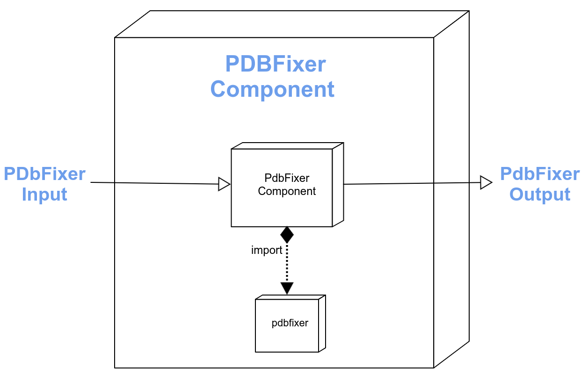

mmic_pdb
==============================
[//]: # (Badges)
[](https://github.com/MolSSI/mmic_pdb/actions?query=workflow%3ACI)
[](https://codecov.io/gh/MolSSI/mmic_pdb/branch/main)
[](https://lgtm.com/projects/g/MolSSI/mmic_pdb/context:python)
[](https://notebooks.gesis.org/binder/v2/gh/MolSSI/mmic_pdb/3530cb20cd9fc6dc9ed3281ca36110453b070968?filepath=mmic_pdb.ipynb)

This is part of the [MolSSI](http://molssi.org) Molecular Mechanics Interoperable Components ([MMIC](https://github.com/MolSSI/mmic)) project. This package uses Peter Eastman's [PDBFixer](https://github.com/openmm/pdbfixer) to extract, fix, and/or convert PDB files to MMSchema molecules. 



### Code snippet

```python
from mmic_pdb.component import PdbFixerComponent

inp = {
    "pdbid": pdbid,
    "add_atoms": "all", # add all missing atoms
    "keep_hetero": "none", # remove all hetero atoms
    "std_residues": True, # convert non-std residues to the PDB std
}

# Execute component
outp = PdbFixerComponent.compute(inp)

# Extract log info and MMSchema molecule
log, mol = outp.log, outp.molecule
```

### Copyright

Copyright (c) 2021, MolSSI


#### Acknowledgements
 
Project based on the 
[Computational Molecular Science Python Cookiecutter](https://github.com/molssi/cookiecutter-cms) version 1.5.
